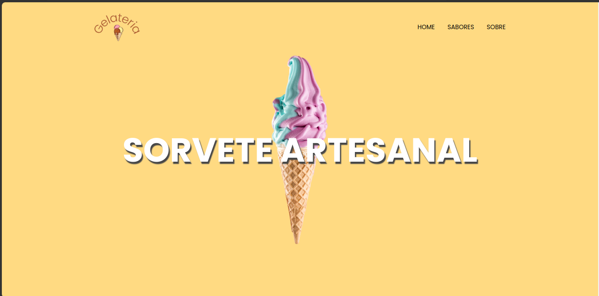

# SORVETERIA & GELATERIA

A proposta desse projeto é criar uma página web para uma loja de sorveteria e gelateria, para colocar em prática os conceitos adquiridos até aqui:

### Acesse o Link: https://sorveteria-geladeria.vercel.app/

  

## Sobre:

Ao desenvolver a aplicação foi possível aplicar os seguintes conhecimentos obtidos na trilha de React.js:

 - Criar componentes;
 - Importar e exportar componentes;
 - Utilizar componentes nativos do React;
 - Organizar o código da aplicação, dividindo-o em partes menores;
 - Criar SPAs;
 - Utilizar o recurso App Router para criar uma aplicação React com múltiplas páginas;
 - Implementar a navegação entre páginas em uma aplicação React.
 - Pagina responsividade;

## Demonstração

Apresentação da responsividade em ação:

